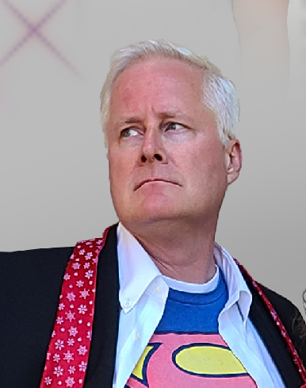





---

# Title

*Tagline*
Summary here

Epsiode Body here.

## Media

<video src='url'></video>

 Podcast Transcript 

1

Hello, thisis Darren Pulsipher chief solutionarchitect of public sector at Intel.

And welcome to Embracing

Digital Transformation,where we investigate effective change,leveraging people, processand technology.

On today's episode,

Intel's superheroes with Cameron Chehreh,

VP and general manager of Intel's

Public Sector.

Cameron, welcome to the show.

Darren Thank you.

It's always a pleasure to be ableto share some airtime with you.

Hey, when we when we first talkedabout superpowers and superheroes,

I thought of something that my family didfor Christmas cardsthis last year, all 17 of us,because I got ten kids.

There's a boatload of kids there.

We did a Christmas card of superheroes.

I'll have toyou guys will see the picture.

It'll show up on the podcast video.

Check it out.

It's pretty funny, but we're not talkingabout my family superheroes.

Today we're talking about Intel's publicsector superheroes and their superpowers.

I love it there and so excited.

So, Karen, let's first talk about you.

Let's give a just a brief backgroundon where you come frombecause you're new to Inteland you bring some new insightinto Intel and some energyinto the public sector team their thing.

Darren, thank you.

So as everyone mentioned, as youmentioned, my name is Cameron Chehreh.

I come to Intel very humblyand honestly throughwhat I would like to thinkis a pretty interesting career.

Darren, but I'll let you and your audiencejudge that.

I started my career humblyworking for the world'slargest privately owned staffing company.

What that introduced meto was a passion for technology.

I had no idea where I was introduced to ita software application called PeopleSoftthat I became very fond ofand ended up learning pretty quickly.

What that led to wasan extraordinary opportunityfor me to help buildthe world's first cloud computing company,the company in Annapolis called UC Center

Networkingand I thinkwere really kind of ahead of our time.

So much so, Darren, that sevenor eight yearsbefore the term cloud was coined,

I'll never forget the night we were havinga few adult beverages sitting in Posers

Pub in downtown Annapolis,and we created the tagline

Software as a service.

Now here's the context.

That's I a little bit.

So that's pretty cool.

And then I seem to have found my waythrough private equity working forfederal systems integrators like Northrop

Grumman and General Dynamics,where I really caught the passionfor supporting a mission.

And that's really what drove me throughthose companies was really supportingjust the amazing peopleand customers within public sector.

I've also been the chief technologyofficerat Dell Technologies for a spell,and now very proudly and humbly,

I've got the great honor to leadjust an amazing, smallbut mighty team here at Intel.

Public Sector.

All right, Cameron,so why why did you come over to Intel?

I mean, you were a Dell, right?

Right.

In the Casa CTO job as a cool job, right?

I've been there myself.

It's a fun job, great technology,drive and drive and tech.

But now you take on a big whopper of aof a positionat Intel, as you know,general manager and public sector.

Why why would you do that?

You know, it's it's interesting.

Darren Dell's a great company.

I had an amazing job.

They're really, really great customers.

Just a marquee brand.

When Pat Gelsinger decidedto leave VMwareand come back to Intel, all I.

I felt the earth shake, you know, beenin this industry a long time.

And if you haven't followedjust the incrediblecareer of Pat Gelsinger,but also our great company,you had to have been a sleeperunder a rock.

If you didn't feel the earth shakeand I took notice.

Pat came back.

He started to build a little bitof a leadership team, and he broughton Greg Lavender, who'sanother icon in the industryand another person that I admire very muchbased on their leadership,their ability to drive teamsand change and transformation.

And although I loved my job at Delland still still do to this day,

I felt a calling because what I saw

Pat doing was looking to reinvigoratean iconic American brand that,quite frankly,did a brilliant job innovating,built an industry around our technology.

We just seem to have lost our waybecause of a lack of leadershipfor for a period of time.

And when you get a leaderthat takes the helm of a companylike Pat Gelsinger,you know, things are going to happen.

And so I heard that callingand I was very, very interested.

I've been a partner anda customer of Intel for many, many years.

Huge fan of the technologygrowing up in operations,because, look, there's competitorsout there and I love our competitors thereand they keepus sharp and and on our toes.

But they're not Intel.

We're the companythat put the Silicon in Silicon Valley.

You know, we are an iconic American brand.

And I heard the callingand I wanted to be part of the workit was going to taketo get us back to that that brand status.

So yeah, you like hard things, don't you?

Darren Not only do I love a challenge,but I believe in the underdogsand the underdog story.

There's amazing people at Intel.

They don't realize they're all amazing,which is the greatest part of all of it,because they have such humilityand humbleness.

But there's amazing people here.

We're doing some extraordinary things.

We have a great business and peopledo the right thing all the time.

And you don't findthat often in companies.

And the fact that we're rooted inthat culturally is inspiring.

So let's talk.

I mean, Pat Pat has been talking to usand we've taken thatinto the public sectorquite a bit on intel superpowers.

And I think there's even morethan the four that Pat talks about,especially in public sector.

Let's talk a little bitabout those superpowers and howthat's helping public sector.

Who are so first of all, we recognize.

Right, what what are the four superpowersas we see them and why do we thinkthey have such a profound effect on on.

I'll say,mankind and humanity in the world.

Right. When you think ofwhat's going on in the world.

Ubiquitous compute.

So when you think of that,it's pretty incredible.

Well, let me list the four so ubiquitouscompute ubiquitous comms I believe.

Right the network pieceof artificial intelligence.

And I'm going to forgetboth the fourth one there and I always do.

And it's so right in front of me.

Edge.

Edge, the cloud.

It is the most pervasive thingthat I got to have a little bit of funwith these podcasts, right? Yeah,absolutely.

Making sure you were on your toes. Yeah.

Thanks for the test.

Let's look at ubiquitous compute to start.

You know, I always had an appreciationbeing technical, but also a consumer.

That technology computereally was everywhere in our life.

It wasn't until I joined Intelthat I realize thethe magnitude of the importance on societythat semiconductor has has.

For me, being an enterprise technologist,it was always about,you know, building data centers.

I got to build the Eastern Seaboardof the Internet physically.

You know, about Al Gore.

I didn't invent the Internet.

Sure got it.

You know, but I never realizeduntil till I came here,because my my orientation changed.

Semiconductors are in everything,literally everything.

Cars, appliances,smartphone cars, computers,hospital health care systems, digitalwreck, literally semiconductors spanthe ecosystem in just about every verticalsized market on the planet.

And it is what is helping usnot only live the best human experiencewe can live,it's actually helping usimprove the quality of our lives.

It's giving us bettersituational awareness, etc.

So ubiquitous computereally means something to usmore than justsome cheeky marketing tagline.

Because we do recognizewhen you look at that,

I'm saving people's liveswhen I apply our superpowerto health care, I'mprotecting the homeland and civilians.

What I think of applying itto a national security mission,

I'm helping improve and advance scientificresearchto look for things like cures for cancer.

Maybe have usnot just put a person on the moon,but maybe live on the moon one day.

Who knows, right? One can dream.

So it's really extraordinary.

So that superpower in itselfis fascinating.

You know, it's interestingbecause I think COVID and the pandemickind of put a magnifying glass on that.

When youlook at the sheer number of peoplethat were still able to workand schools were still operating,albeit not perfectly,but our kids were still learning.

And now it's all because of Silicon.

Darren That comment.

I pausedbecause I wanted to let it linger therefor a moment, because of the power of whatyou just said.

And yes, unfortunately, unfortunately,it took the pandemic for usto recognize the true value of it.

Now, I'm an optimist eternally.

I was I was, I guess, born an optimist.

I'm going to die an optimist.

And I'm even optimistic about dying.

Derek, let me be let me be clear about it,but the pandemic truly showed usthe power ofwhen we can apply silicon for good use,what it's done.

Right.

Because to your point, we shifted learningfrom a kinetic environment, right?

Going to schools to a virtual one.

Well, there was a little bit of benefitthat got exposed to people that we neverrealized, like closing the digital dividea little bit more,being able to fulfill that for, let's say,people with disabilitiesor being out of necessarilybeen able to attend traditional schooling.

They're now offered thisthis great digital format to participateon an equal playing field.

And that's humbling because,you know, to be able to help peopleusing what you do on a daily basisas a job, there's nothing more fulfilling.

And I agreewith you, the pandemic really revealeda lot of these things where digital nowis front and center in our lives.

You know, this brings on to the nextthe next superpower,which is the calm side of thing,because if you just have silicon out therewithout it being connected,it doesn't it can't be it can't realizeall the potential they can have.

And we saw a huge uptick in comms and 5G,kind of got a kick in the pantswhich it needed to be adoptedwith the pandemic as well.

And I'm glad you brought that up.

Even today, I've got a bunchof high scores and three high schoolers.

They all have Chromebooksnow where before it was, well, you checkthe Chromebook out for this one classand you hand in at the end of class.

That's done.

Every student has a Chromebook nowin, I would say a majorityof the school districts out there today.

This was a this was a huge shiftand we're seeing teachers shiftto because of that connectivity.

So can you talk a little bitabout Intel's comms?

What are they doing in comms?

Yeah, so it's really interesting, Darren.

People look at usas we're just this chip company.

I don't know if people understandthe entire portfoliowe have for interconnect right.

Because interconnect,as you mentioned, is so important.

I mean, the work that we do out of ourany extra visionand how we're connecting peopleis the other superpower for a reason.

And to your point, look, there are timesand there are certainly mission scenarioswhere we're disconnected,where refer to superpower number onemakes it so important, because I can thenbring the technology closer to the dataand should let's say

I'll use a military example.

In this instance, you've got a warfighter,what's called a DDL environment,a disadvantagedor a disconnected environment.

They're still able to use the computelocally in the informationthey have to be able to executeon that mission when they reconnectto whatever comms they're using,whether it's legacy, 4G,or some sort of wireless,then they can continue to get betterconnectivityand up to date informationwith regards to data, that's transmission.

But if I go to the education scenariothat you talked about thereand interconnect is vitally important,you know, getting accessto data, the streaming,the video content, everything elseis just so vitally important.

And I don't think people realizejust how powerful it can be.

Now we have gaps, right?

We still have areas of the countryand the worldthat are not able to participatein the digital economy.

What's fascinating is, and I'm sad to say,this closing the digital divide inthe United States is becoming much harderthan it is in developing countries.

Developingcountries are able to leapfrog usbecause they're investing in 5G, sexy,you know, non terrestrial comms.

Now, there's issuesassociated with that as well, butthey're able to invest in thatand close the digital divide much faster.

But to your point,that superpower is equally as importantbecause let's faceit, connections is one of the fundamentalbasis of being humanand being connected to others.

One of the most fulfilling thingsyou can do.

Oh, I totally agree.

And you mentioned a little bit about edgeto cloud, especially with the warfighter.

And this is dear to my heart, too,because I've been doing a lot of workin that digital environmentand architectures around digital.

Tell us a little bit moreabout Intel's and their edgeto cloud strategy in that you know,why is that important to usand what do we have on the track to helppublic sector in this space?

You know, Darren, it's fascinating.

Cloud and edge.

And, you know,all these interesting trendsthat come in in technology,they have a profound effect on businessand on mission.

And I know people have talked about cloudfor a long time.

And it you know, people are like,is it a fad?

Is it a trend?

Well, there's a big difference, right?

A fad is we're all not walking aroundwith mullets anymore, thank God.

Oh, no, they're coming back, man.

They're coming. Back.

Let's hope not. They're right.

But a trend.

And I mean, excuse me.

Yeah, a trendrather than a fad is somethingthat has the opportunityto help us progressand grow and learn how to adoptnew methodologies and new things.

When I look at edge to cloudbecause the underpinning capabilityis compute and interconnect,we play a significant role.

Now we have to do it with our ourecosystem partners and our OEMs, right.

But edge to cloud what it providesif you really harnessthe true power of not only the siliconbut but software,you can secure workloads,you can do more high assured computing.

But what it affords you the opportunityto do really is interoperability.

So I can move workloads from an edgeto to a cloudor to a traditional data centervery seamlessly.

But I'm using open standards andand core technologiesand that edge to cloud strategy.

And I would offer you, Darren,you know, we've seen this in our industry.

Trends change.

You know, when we started many, many,many years ago,when computing was for the eliteand the educated,it was mainframes and supercomputers,because that's the only institutionthat could afford them.

And that's that was okay. Right.

So it was this centralized modelthat everyone logged into.

I'm old enough to remember, you know, 5270

Green screen emulators for mainframes.

Then it shifted to this client server,so it became very decentralized.

Cloud comes aboutand it goes back to a centralized,geo segregated mainframe.

It's just modern. I know all the CCP's.

I love them, but and I know they hatewhen I when I say that.

But it it's about a model,an architectural construct.

It's not about the technology. Right.

With edge emerging,

I think what we're going to seefor the foreseeable future, the next 20,what's going to really roll and dominatebecause as we make things smarter,we have to take and push the technologyout to the edgewhere the information'sactually being created,and then processing happensin a centralized mannerfor more analytics, air, etc..

Right.

We're not going to go backwards, right?

Cars aren't going to get dumber.

We're not going to make a gas powered

Tesla.

That right.

You know, now is a gas engineand is not got coolfeatures and and gadgets and widgets.

Things are only going to progress.

They're going to get smarter.

So the edge is going to be extraordinarilypervasive.

And as an industry, we're againcreating self-inflicted wounds.

We haven't done a good jobat defining what that is yet.

But but we know what's emerging.

Yeah, in fact, I kind of likethe data center without walls concept.

And where is my data?

My data is everywhere now.

And how do I make intelligent decisionsbased off of all thisdata collected and processed everywhere?

Right.

Including a cell phoneor a sensor or a cameraor in the industrial space,in motors and pumps and things like that.

Those are becoming intelligent,which leads to our next superpower,artificial intelligence.

Right.

And people don't know this about intel.

We have one of the largestartificial intelligence portfoliosin the world.

Darren, this is why I love this company.

Humbleness and humility is isa is a great cultural attribute to have.

But unfortunately, at timesit works a touch against us.

And I'm a little okay with that because Ido like being a cheerleader for the head.

Look, artificial intelligence.

Here's a few things that that people don'tknow what might surprise them.

First of all, we have a software portfoliothat is extra ordinary.

We have more software developersthan some software companies.

And there's a need for that.

There's a reason, right?

Because, look, I love Greg Lavender.

What? He's such an amazing CTO.

He has this expressionthat you have silicon, butsoftware is the soul of silicon, right?

You have to allow it to do something.

You have to give it life,you have to give it a purpose.

And AI is a great example of it.

And and Darren, it's fascinating.

People say, oh, well, I all these techguys talk about AI, you know, what is it?

Are we going to have robots and all these?

Yeah, we're going to have them.

But let's talk about a practical use case.

I'm lostin the UK, happens to be off the dirt.

As much as I love traveling the UK,

I travel all over the worldand I can't rememberhalf the cities I'm in, but I'm lost.

I pick up my phone and immediatelybecause GPS is coming down on my phone,

I could say,

Hey sir, Siri or Hey Google, I'm lost.

It brings up maps, a geo locates me,finds me where the closest pointof civilization is.

That's just a practical wayof where I would apply for good

RS Doing profound things for us as people,you know.

And look, I don't have a great senseof direction thereand so I need a lot of help.

Now we're also seeing because Intel nowubiquitous computeand the advanced comms that we have,we're seeing more of these edgedevices become intelligentand we're actually decreasingthe amount of data that needs to moveoff the edge and into the data centers.

Because we are running

AI algorithms to infer on theedge what we're looking for.

And alot of people don't knowthat we've got this kind of technologyand it's built into our CPU's directly.

And also we also have specialized

XP use, right neuromorphic processorsthat do the same, samesort of thing at lower wattageand higher speeds,which is pretty darn incredible.

You know, Darrell,what I love about your podcast and this iswe can have a conversationin English rather than geek speak,because I think people need to rememberwhen we satisfy a mission,you have to be able to understandwhat you're doingis an impact using the technology.

And you're absolutely correct.

I mean, look, I love our

IP use, our expertize, our GPUs, our CPUs.

It's pretty extraordinary what we can do.

But let's practically apply.

And if I go backto, say, a civilian use case,look at the Postal Service.

It's shocking to me.

Most people,when they look at Postal Service,they don'tthey don't necessarily see on the surfaceand an organizationthat's innovative all there.

But when you see the next generationdelivery vehicles, the amount of sensorsthat are on that thingand what it's doing, it's as modernas Google Street view the carsdriving around, mapping certain things.

When you look at Postal Service centersthat do mail sortinghow they're applying,what you just described in our portfoliodown to these kinetic sorting machinesso that they're getting smarterabout where mail goes and safermail handling and all these otherextraordinarily positive things.

They're leveraging technology to scale.

And it's pretty extraordinary.

We look at other use cases, Darren.

I think of first responders,you know, being able to put more siliconin law enforcementvehicles to do smarter things,to create better situational awareness.

It's all about affecting the humanin that mission environmentin a more positive way, giving themmore access to the information,but in a consumable,humanly consumable format.

And Darren,that's the piece we miss all the timefrom an AI perspective,we get so geeked up talking about the techwe forget, like the simple example

I told you about in the UK beforein a few seconds

I can visually look at somethingand ingest 600 different data pointswithin a split second.

Just visuallypresenting the data effectively.

And when I look at a hardwareor software portfolio,that's the power of what we do is Intel.

Now, look,some of these things are aspirational.

What I love about our companyis we do bring a bag of partsthat are very relevant.

We have amazing partners in our ecosystemthat help us bring that togetherto create real solutions that arebeing very careful with my words here.

And then you've got partnersin the last mile, that critical last milethat every customer needs us to help usintegrate those solutionsin that mission environment.

It it really is a great place in theecosystem to be because we are innovating.

So that's one thing

I, that's one thing I really wantto come up with our superheroes.

Our superheroes are our our employeesand our ecosystem.

Our apps.

And this is somethingthat always kind of shocked me.

We we have one of the most incredibleecosystems to bring solutions to market.

And we don't even bring the solutionsto market.

We will.

And it's amazingeven some of our competitorswe work with to solvereally tough problemsfor national defenseor for public service.

And Ithink the reason why and one one reasonwhy I love this team that I work on inpublic sectoris because we are making a differencein lots of people's lives, day to daylives.

The things that we're bringingabout today.

Well, Darren,

I mean, just a testament to that.

And I hope these people don't kill me,but I need to mention thembecause I admire them a lot.

Being able to hirethe people we've been able to hire,like retired admiralsand generals and chief warrant officers.

You know, we've got an amazing team herethat helps us every single day.

Remember who we serve.

You know,look, I'm very proud of our companyand proud of our tech, our innovations,all these different things.

And I'm proud of our people.

But without those people helping,we're helping usremember that it's us and the ecosystemwe've created because we did create that.

Let's let's be very honest hereto serve this this great missionand not just our government,but governments worldwide and our alliesand all those things.

It's a pretty humbling experience.

But you're right,it is all about the people.

Yeah, no, I agree.

So, Cameron, thank you for making my 100thepisode enjoyable.

I'm honored.

Right.

You got theyou got the privilege of being number 100.

Darren, I'm so honored.

Look, these these are great podcasts.

I hopepeople are getting the value out of themthat you and I know we see out of them.

And it's really extraordinary.

And I can't thank you enoughfor continuing to carry this torch.

Hey, thanks a lot, Cameron,and thanks for supporting me in it.

You never know when you get a new bosswhether he's going to like whatyou doing or not.

So I love you there. And.

All right, thanks a lot, Cameron.

Thank you for listeningto Embracing Digital Transformation today.

If you enjoyed our podcast,give it five stars on your favoritepodcasting site or YouTube channel.

You can find out more informationabout embracing digital transformationand embracingdigital.orguntil next time, go out anddo something wonderful.

