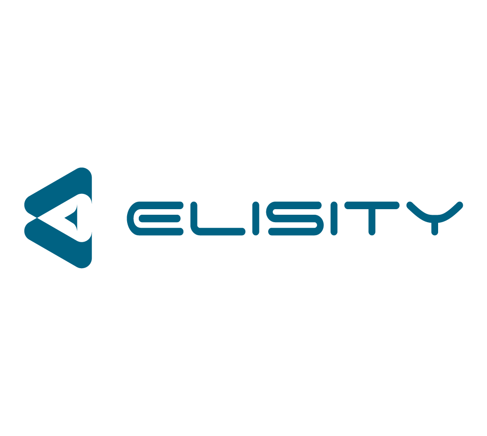





---

# Title

*Tagline*
Summary here

Epsiode Body here.

## Media

<video src='url'></video>

 Podcast Transcript 

1

Hello, thisis Darren Pulsipher chief solutionarchitect of public sector at Intel.

And welcome to Embracing

Digital Transformation,where we investigate effective change,leveragingpeople, process and technology.

On today's episode identitybased micro segmentation.

Part two of my interview with Elisity.

What's the new approach here?

Because and Dan,you and I have talked actually quite a bitabout the impacts of networksecurity on OT networks.

But before we go down that rabbit hole,let's let's help people understandwhat other options do I have?

And this is where I was impressedwith your guys's approach, which,which you guys called identitynetwork security.

Right.

Or identity based micro segmentation,least privileged access architectures?

I did.

It has a big what you guys got.

I like what's.

What's the acronym for that. Yeah.

I thought of in there.

We should get one thing.

Yeah.

Hey, you got to have a good acronymfor that one.

Identity based.

IBM s identity. Based.

IBM's and. IBM. Hastheir own security.

It's something like LP and Privilege

Access.

Well, it was coolwhen you guys explained it to me. Solet's start at the basicsbecause this is pretty deep stuff, right?

So what's yourwhat's your biggest differentiator?

What's your different approachto network security?

Yeah, I mean, it's it's all about well,it's a couple of things, right?

There's there's how it's delivered,how it's distributed aroundacross the networkand how this can be doneefficiently, effectively and providerapid time to value.

That's what we've been focused on, makingthis as simple but effective as possible.

And intuitive so that really anybodyin any segment of theof the environmentor a segment of the industrycan leverage this technology,whether you're in the OT space orin the IOT space, medical space,

EMT devices, it doesn't matter too.

To us.

These are all just important assetsto the organization we need to secure.

But I think we've been talking a lotabout micro segmentation.

We keep using this terms.

Maybe we should talk about what reallywhat that means to Elisityand then that will help framehow we approach the problem.

So so what is micro segmentationfrom your guys's perspective?

Because I think I know what it means,but you guys blew that awaywith, you know, VLANs andand firewalls is too complex to set up.

So what do you guys meanby micro segmentation?

Yeah, that's a great question,because micro segmentationcan mean a lot of different thingsto different people.

The same way that word, zero trustcan mean a lot of thingsto a lot of different people.

But I mean, micro segmentation,for example,in the data centermight mean the ability to separatelayers of applicationsor workloads from each other and somethingcompletely different in the spaceand something different the Iot space.

But micro segmentation to elicitedis the capabilityto completely isolateany type of user device or application.

No matter what type of network it'son, where it's placed in the network,whether it's managed or unmanaged.

To us, it's the complete flexibilityto isolate one assetfrom another without restrictionsimposed by network architectureor network constructs like VLANs or Vor FS, which are super rigidthings that are that we get stuck on.

So then the questionthat you're probably asking thatwhat next is how does eliciting set it up?

How do we handle it right?

And that's a big part of the challengethat we've been solving forhistorically micro segmentation.

No matter what platform you were tryingto deploy it on or configure iton, require a lot of networking knowledge,tons of planning most of the time.

Yeah.

Hardware replacementor on prem appliance instantiationand this is stallingthe time to value for customersare they need a solution nownot six months from now when you get it upand running it usuallyit takes months, two yearsto get any value out of the traditionalor a lot of the solutionsthat are out therethat are being advertisedto provide this functionality.

And that doesn't flyunless he's found great successby shifting to a cloud nativeand cloud delivered microsite mentationplatform.

You've probably heard this before.

ISDN solutions like Meraki.

Yeah, yeah, yeah. Like Meraki or Tela.

I'm originally from Telco downand worked with the Taliban Cisco,when for a long timewe understand how powerful this clouddelivered software defined networkingsolution is for anything for security.

In this case, it just scales really well.

It's easy to managedistributed dynamically.

And so our our entire controlmanagementand policy plane is fully cloud delivered.

And the eliciting componentthat ties to your onprem network is 100% software,and it's a lightweight software.

So we've made this incredibly easyto deploy and configure.

There's nothingyou have to really change on prem.

It rides ontop of your existing infrastructure.

There's no hardware to change to replace,and it makes it easier toget up and running.

And you can write your policyand apply it within a week.

So that sounds a lot to me because I workin the container ecosystem quite a bit,so and I already know the answer,but I know my, my,my listeners are going to think,

Oh, you guys created something like Calicoan overlay network,but it's not that.

Go ahead.

Yeah, go ahead.

Then I was

I was kind of in the sense of we,we delivered in a sense, it'scalled a microservice and to tap on to it.

And so we're going to talk a little o.ttoday is everything Dana just describedis also on premis that we started in the cloud,but knowing that, you know, a lot oflistener is going to be in the area,everything we actually had a few customersthat said, hey,we love what you're doing,but we need that behind L 3.5.

We need that behind the DMZ.

We need to be able to cut off all accessand we've delivered that too as well.

And so everything

Dana mentioned is completely accurate,in addition to the fact on prem or cloud,we can both have both offerings.

You good point.

But from a from a function perspective.

Yeah containerization is thereyou could the easiestrepresentation is a microservicein the sense of horizontally scalable.

So you start small you add 10,000things to the in the networkand we just scale with you andwhether that be on prem or in the cloud.

Yeah, but, but the differencebetween what you guys doand what I've seen with overlay networks,overlay networks are still dealing with.

Right. Yeah. Your how.

You guys don't you guys only deal with.

Control.

I like to say the policy plane as well.

I love that you brought this upbecause it's a massive differentiator.

It's something we're really proudabout thatwe're able to apply the same levelof granularity when it comes to networksecurity without touching a singleone of your packets.

And we were injected in the networkin that we can seethe metadata of identityof all the flows in the network,and then that informationis sent up to our cloud engine,which can then figure outwhat policy you'd be appliedand push it push that policydown to the edge of your networkwithout actually touching your packet.

We use your existing infrastructure,whether that's catalyst 9000 seriesswitches or Catalyst 3850 Series,which is another host of vendorsthat we're bringing to the marketnow that we're going to support.

We're using that native functionalityon thatswitchso we don't have to inject our software inin benign.

So to me, because you're at the controlplane and you're not dealing,so you're basically telling dynamicallythe networkwhat to do based off of the identitiesthat you find on the network.

When people have registered on this deviceor on this application,running on this device, and I can specifywho else I can talkto, all based off of attributes of that.

That's absolutely correct.

And before we talk about the identitypiece of this, I had one more thing

I wanted to talk about when it comesto simplifying and obfuscating complexityfor the end user, because our number onegoal is rapid time to value.

So it's not just about the deploymentof a solution.

Yeah, we've made it so simplethat you can deploy thisand get it runningwithin a week to two weeks.

But it's the ongoing managementand operations of this platformthat you also need to be concerned about.

So by abstractingand obfuscating the complexity day.

To day, to.

By obfuscating abstraction,the complexity and keeping it intuitivefrom the perspective of the end userand making this distribution of policycompletely automatedacross the entire network,there's little friction here long term.

It's supersimple to manage long term as well.

Yeah, that to tack on to that.

If I'm if I'm a plan operator, if I'm aif I'm an X operator, I'm doing somethingand I'm maybe

I have a little bit of network backgroundas I need it to be useful,but I'm not a I'm not an IEEE.

I might not have been ina, you know, from that perspective, we,we've built the solutionso that you can look at our policyengine and say,hey, this needs to talk to that.

And you can interpret andcompletely understand what's happening.

You don't need to know what VLANs are.

I could flip your original questionand say, what aren't we?

Yeah, not a switch managementtool in the senseof we're not trying to deploy VLANsor we're not trying to deploy Verve's andand port configuration because nothingwe do has anything to do with any of that.

We don't carewhat port you're coming in or leaving,we don't care what VLAN you're on or whatversion or what the routing looks like.

It's completely abstracted away from usand the abstracted words a dangerous worda lot of the time.

But with our solution it'scompletely indifferent.

You could have one good example.

You could put everybody in a slashand we're going to work perfectly fineenough to put everybody into their ownindividual VLAN and everybody gets a verveand you have a really big BGP config.

Thereand that would work perfectly fine as wellbecause of how we we work with the controlplane topology independent.

Yeah. So energy independent.

Topology.

Yeah. That's pretty impressive key.

Because now it makes usa universal solution for any industry,any customer without any friction.

They don't have to go in and redesigntheir network, add new VLANs, IP,none of that.

We'll just layer right on top.

Okay, so let's talk some practicality.

So my so my listeners can understandbecause we're going to getreally geeky here.

We already started getting geekyslash AIDS like,come on, damn, I know you're a CNE.

I could tell you're a network engineer,a certified network.

You know, I know what that means.

Only because I had beat over my headby one of our internal network engineers.

But practically speaking,what you guys are saying is, I can say

I've got a certain device by identityand I can pin it to only talk to or.

Users or applications.

And you can do that device.

It's usually for applicationsor applications.

I look at this as like,yeah,

I users to it's just like trifecta, right?

So users devices, applicationsand then within that triangleyou have all these lines of thingstalking to each other there.

We could secure every single channelbetween userdevice and application with granularitywithin that triangle.

That's the visualization.

All right.

So effectively what you could do andyou're doing this at the network control.

Layer at the edge. Right.

So that traffic won't evenit won't even the edge.

Exactly.

Those networks at the moment,the traffic hits that first edge, switchthat ingress point.

It's being secure.

It doesn't have to go anywhere else.

It's the most efficient wayto apply security right at the edge.

Yeah.

You know, it it really sounds to mea lot like the originalcontrols they put in Unixwhen Unix was running on just one machine.

Right where I've got identity,

I'm only allowed accessto certain programs, certain dataand certain directories, right?

And a lot of times maybe even certainamount of processing power.

I had quotas and and all.

But you guys have done thisat the network,which says that when I come inmy identity, I come in as Darren.

You guys can really pin me to

Darren gets to run three applicationson these three machines and that's it.

Yeah.

Darren you know whywe have to do it at the network layerand not at the applicationlayer is because not all of these.

Okay.

First of all, we have usersthat might be on Macs and laptopsand things like thatthat you can put a user agent.

But what about all the tens of thousandsor hundreds of thousands of devicesin your network that you can't putan agent on, that you can't modify?

They have embedded operating systems,cameras, badge readers, people.

Oh, especially on the outside.

You can't happen at the device itself.

It's got to be.

Yeah, rightwhere it comes into the network.

I love your guys's approachbecause what you didwas you destroyed, what,four layers of the network, right?

Interesting. Yeah. Yeah.

I mean, you did. You did.

Yeah.

You you said I what you're saying isthey're still important,but I'm going to secure it.

Not at the top of the stack. Yeah.

The bigger down lowand. Yeah.

And you guys, you're doing it at leveltwo right.

There's still a use andthere's still a requirement for firewallsat the layerthree boundaryor at the edge of the network.

That's that's always going to be there.

But yeah, of course, a more efficient wayto do it at the edge of the networkfor that lateral East-West within VLANs,across pipelines or cross border ups.

And we can also do thethe North-South piece of it.

But yeah, it's we have really madesome these legacy mechanismsto be really deprecatedat this point.

And let's dig into OTTI.

All right.

Because I want to because this is thisis a big, huge thing I'm dealing with.

Right now with a lot of my customers.

I am very worried about securitybecause of security has an impacton functional safetyand and safety is the real world.

So I know, Dan, this is a sweet spotfor you, too, so help me understandhow I can leverage your guys's approachand your guys's solution stack in in O.T.

Network, becausethere's a lot of caution.

Ah, caution around O.T.

So how does this help me even more in the.

Yeah, so the 10/2, the classic thingyou hear kind of almost every timepeople talk about it versus O.T.is the, the fundamental differenceof what we're trying to accomplish.

If I'm thinking it, I'm thinking security,

I'm thinking integrity, confidentiality.

I'm thinking I want to protect what I haveavailabilities there, too.

And we've kind of solvedthat in different ways.

But the focused.

Yeah, yeah.

We just spin up a new instance if if we'reintruded on, we can spin up a new.

Very easy to rinse and replace.

It's very easy to just blow things away.

Like it's not a big deal without thethe equations flipped wherethe the cornerstone of your safety.

Now we need availability,we need integrity.

We need ourour things to continue to function.

But it's c it's safetynot just for people,but safety for the processbecause the process could representcritical infrastructure.

And so it'sa completely different mindset.

So and a good comparison is something init might exist for six months or a year,something in OT might exist for 20 yearsin the sense of a process that you have.

But I have run into that where I have a

I have a 50 yearold controller controlling.

I don't I don't doubt it. And.

And they're not going to replace it.

And they're probably doingkind of a fail till maintenancethinking in the sense of that,then that's a very commonthing in the sense of,hey, I'm just going toand that's a very valid designwhere you've got people like,

Hey, every ten years

I'll maintain it or something like that,or I'll patch it every couple of years,and then you've got other ones that goeven to the extreme.

I will not touch that environmentuntil something bad happens.

So it's just it's it's completely off,you know, hands offuntil some type of failure event.

And that's on purposeoften enough as opposed to not.

And so the intentionthere is just totally differentand now comes they're looking forand so on the outsidethe idea would be essentiallyto make sure that that safety,which equates to restrictingconnectivity, restrictingwhat who can touch what through userswe talked to a second agoand something as simpleas to bring back the VLAN example.

Just because you're in the VLANdoesn't mean an hour to you andyou know,another hour to you or a sensor orsome HMD or a DCSthat might be one switch over.

Doesn't meanthey have to talk to each other.

They should.

There may be no valid business casefor them to be talking.

And the crux of the legacy design is that,well, I put them on the same VLAN.

There's no way for me to stop thatunless I go really far into the toolboxand start doing vehicles or some goofystuff like that, which is just.

Exotic. Then it. Becomes.

Greater demand to manage who the heckunderstands how it's configured.

Right?

So, so with this,we talked a little bit about alsomy, my concern is identity.

You showed me that

I can actually group things together orput attributes on assetsand set up policies based off ofthose attributes as well or those groups.

So what that means, instead of saying,

I have to go through every single deviceand say these devices can talk to thiscontroller, this segregation switch,whatever the case may be,or aggregation data point,

I can say, hey,all these devices are sensors.

They can all talk to this aggregation datathat aggregating all data sensor,but no one else can talk to it.

So instead of having to goitem by item and say, I, this can talkto only this, I can group things togetherand how possibly.

We think people are going to do thatmore often than not, in the sensethe idea of us walking into a refineryor manufacturingor into some type of transit authorityor something like that, and say, hey,let's go down to the boneand let's make everything very exact.

That's just that's not real world.

And so we've designed our solutionto be incredibly crawler, right?

Meaning that, hey,

I just want to group all my processesand they can only communicate north south,no more east East-West,something as simple as thator hey, my line managers, they can it,they can communicate to the,the six or seven types of thingsthat they should huge broad brush hereand then my actual operators who actuallyyou know SSA or terminal into devicesand actually modify places livewell they can hit the placesthey can at the to usebut nobody else gets something as simpleas that where you might have twoor three policies for an entire planbut you just took your attack surfacefrom 65,000 potential attack,you know, your ports, for example,down to two or three.

Yeah. And so huge, huge, huge.

Vastly quickly.

Yeah.

So so thisthis really turns the network on its earbecause right now what people dois they air filter density networks as.

They go down. Yep.

Yep, as they go down and then they saythat's how on protecting it.

So they don't even use

VLANs. Yes, they use landsand they say,you know,no traffic can leave this little thing.

But with this stuff you can control thethe East-West traffic and the North-Southindependent of each otherand be very explicitand not worry about the topologyof the network itself,which I think is is valuablebecause how many times

I've even seen this onon naval shipswhere a, a captain needs some informationfrom one networkto the other that are air gappedand guess what happens?

They put a jumper cablebetween the two switches.

They're going to secure and get the go.

That's a user trust security officer.

Right.

And then and then the one sailor sailorthat did that,you know, get sick or,you know, something happens where he'sand no one knows that it's happened andnow you're running on secure with this.

I have visibility. I have control.

And I love the rapid time to valueand intuitive effective control.

Thank you.

We think so as well.

What you guys just just describedwas the whole conceptbehind identity based security.

And so what that means to usendlessly is about leveraging dynamicallylearned and updated attributesof all the assets in in your networkand using that as policy match criteria,using those attributesthat we dynamically learn and inventoryas part of your policy match criteria.

So as you as Dan said, you can make supergranular policies saying

I want all Siemens places to do thisor that or have access to this or that.

And I want all of these other typesof humidity sensors to do something elseand have access to something elsebased off of the model namethat the vendor,the device behavior or whateverit might be, but not based offthese rigid constructs like IP addressesand VLANs that don't tell us anythingand are only valid for an assignedand for a point of time right?

Yeah.

It just means that this policycan dynamicallyupdate and changeif the asset has also changed.

So it allows us to bring continuousverification in this environment as well.

I see another great use case for this.

This happens a lot in hot networks.

I have a vendor that has to do an updateon my on my device.

So what do I do?

I let them in to my networkfor a short period of time.

And guess what?

They have access to my whole network.

Yeah. Once you're in, you're in.

It's you're in, you're with this.

I can say I'm giving it to youfor 12 hours.

Exactly. Access to this device.

And that's it.

That's all you get.

Access to it even further.

I'm giving you short for 12 hours.

Here's the port combinationyou can communicate on.

Here's the passage you're allowed to touchand at the end of the 12 hours,that's the contractor example.

It's just there'sso many numerous examples there.

But to put it simply, isn't it?

They walk in to the door and they have to,you know, depending onwhere you throw them, it's you have toyou have to throw them close to the bottombecause that'swhere their their stuff is sitting.

They could have access to,you know, a thousand thingswhen they might only need access to two.

And so it's just a different gamewhen you can restrict themto those two thingsand to three ports and say, you know,here's the here's the two touch points.

You can have and nothing more.

All right.

So if my listeners want to find out more,they just go to listen Ecom.

Is that where they startto reach out to you guys?

How do we get them in?

You know, information? Yeah.

We have a ton of resources on our websiteand let's see dot com.

And if you look at the top as a resourceis what are videos and white papersand I'm on on the technical marketing sideso you can go and read all my documentsand really understand how thesolution works and how it would be appliedin your network.

And you'll see how quicklyyou could get this up and runningand seeing that value within a weeknow. And it's pretty cool.

And Dan, I know we're going to havemore conversation about the hot side.

I'm until I'm working on somethingright nowcalled hardened team managed security,of which I've already put you guysin the architecturefor my identitybased security at the network side.

So I love your guys approach.

I think it's pretty clever and simplewhich, which to me those arethose are the best. Absolutely.

That way.

Thank you for listeningto Embracing Digital Transformation today.

If you enjoyed our podcast,give it five stars on your favoritepodcasting site or YouTube channel.

You can find out more informationabout embracing digital transformationand embracingdigital.orguntil next time, go outand do something wonderful.

