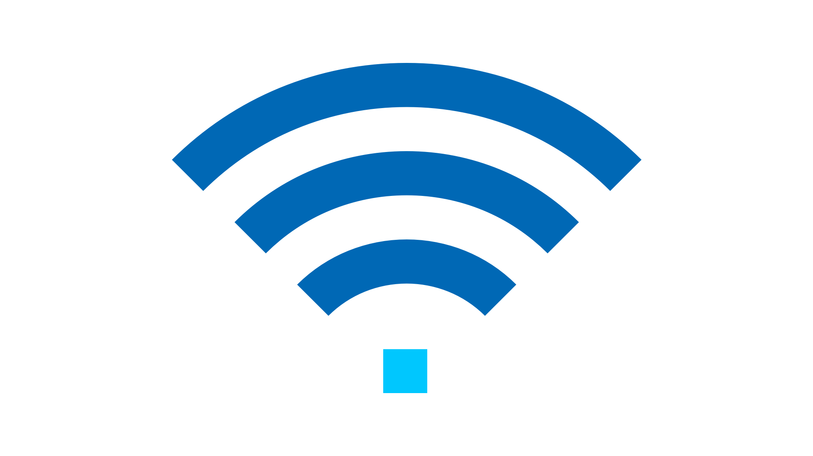





---

# Title

*Tagline*
Summary here

Epsiode Body here.

## Media

<video src='url'></video>

 Podcast Transcript 

1

Hello, this

is Darren Pulsipher, chief solution

architect of public sector at Intel.

And welcome to Embracing

Digital Transformation,

where we investigate effective change,

leveraging people, process

and technology.

On today's episode,

Advanced comes on the edge with Dr.

Anna Scott and Leland Brown.

Anna Leland, welcome to the show.

Hey, Darren. Thank you.

You are both not newcomers.

Leland, you've been on the show twice now

and Anna is a regular now.

And Leland,

you're technical director of advanced

comms at Intel and those of, you know Dr.

Hannah Scott,

she's our chief edge architect

for Public Sector Intel.

Guys,

it's always a pleasure to have you on.

Normally, I'd say introduce yourselves,

but everyone already knows you.

Well,

yeah, I'd say Darren, as like

I said the last time, you

one of my favorite people

to work with at Intel.

And now you have another person

I'll always love to work with, Anna Scott,

so this would be a great time for me.

So let's, let's yeah, let's start off

by talking

about the history

of advanced communications in general.

Right.

I don't want you feeling you're the man

here when it comes to advanced comms.

Let's not go all the way back

to the telegraph, but let's go back.

Let's let's take a little step back.

Okay, great.

So, you know, when you think about

cellular technology, you may

if you want to talk about communications

and what's really when someone thinks of

communicating now, they're not thinking

about a phone or a desk,

you know, or some type of hit,

you know, device move.

That's like old bell phone.

They're really thinking

about a cell phone.

So where did it start?

You know, we're going back to maybe

very late seventies, early eighties.

Know, we got into something called APTs,

Advanced Mobile

Public Service, I believe it was

that what was he

and stood for around 81

if you had the ability to make a voice

call,

you were the greatest person

on the planet.

If you could sit in your phone,

sit in your car and,

you know, make a call like you were like

the coolest person running around.

I actually had a back phone in my car

when I was in my early twenties and very

I thought I was rich.

No, I wasn't rich.

I just got a back phone, you know,

it was like a cell phone in a car.

But did you mean. Wait, wait, wait.

We Leland, you got to back up.

Did you milk that? I hope you milked that.

Oh, no.

Yeah, I mean, I really.

I just want to make sure, man. Oh, yeah.

Mean college and things like, man,

what's going on?

But, you know, it was it was really

if you were able to make a call

that was like

the greatest thing I could call.

Now, of course, as you know, luxuries

once tasted, you know, become,

you know, a necessity.

So the necessity to make a call

and a requirement to make a call

when the cell phone became the foundation.

And if you couldn't make it, as things

went on into what we call 2G,

which is more our time division

more two more multi access

type type of technologies

I think GMC may have

I'm sorry, GSM may have kind of kicked

in around that time period.

You were getting more into, well,

can you text, you know, can we make phone

calls and text, you know,

maybe early nineties time time period

when 2G was starting to really kick in

and of course, again,

that became a necessity call text.

Okay, maybe playing SMS on a phone

where phones went from this, making phone

calls, see, turn it to device

you can do a little bit of games.

You know that game called Snake on over

if anybody remembers.

Oh yeah, I was good enough. Snake.

Yeah.

It's not I mean that

that was really the time period

where 2G was starting to turn the phone

into something a little more and

and down buttons and making the call.

And you got to 3G and 3G

brought on the ability

to do some nascent data capabilities.

What I mean by

that is the Internet was in its early

stages, late nineties, early 2000.

Can you do the same thing on the phone

and you want to talk about call?

I actually had a phone.

It was it was a flip phone.

I will be called a clamshell phone

where I found it.

The ability

to take the take a dongle connected

into my PC, a slot on my laptop.

And if you type £10, seven, seven, seven,

it gave you direct access

to Sprint's data network.

And from there, I was able to have

my laptop be a mobile device.

You know,

we take advantage of Wi-Fi nowadays.

That did not exist back then.

So it was really cool.

I mean, believe me, I was you know,

I was dating at the time of Give a girl,

hey, you know, you want do your work.

So how can I did I got you hooked up.

So, you know, it was it was really cool.

But think about it.

That was very I mean, very minimal.

I mean, maybe DSL speeds,

if that modem speeds really

that I

was able to manipulate the system

to going to give me data only calls

that we take for granted nowadays

with this phone can do

you know we take take take me

you take it for granted

you know what what smartphones can do back

then that didn't exist

now after 3G,

we transitioned into 2

to 2 areas of scope,

a unified standard, meaning that

then you had CDMA, Qualcomm, you had GSM,

you know, and you had the carriers back

then that existed Sprint.

And the time may be Bell of Manticore

probably just starting

to turn into Verizon.

More on a C CDMA track.

You had T-Mobile

when you had AT&T on a GSM track,

primarily 4G converged it into one

LTE under 3G p.

Okay. That evolved

standard turned where

every carrier started to adopt,

you know,

a common standard across the board.

Now, we could talk about WiMAX as a whole

nother long term discussion.

Everybody went to LTE primarily,

and that's when you saw

the proliferation of broadband.

If you think about companies

like Amazon, Netflix,

over all the platforms you to Google,

Facebook, everyone that there are common

now for us you take away the smartphone,

you take away broadband

and in the hand will not exist at all.

I give full 4G credit

for really proliferating

the advancement of our economy

through to the 20 tens.

Without 4G, we have.

Okay,

so now 4G has been out for a long time.

now's physically right. Mm.

So that's where we're at today is 5G.

So I have a tendency to

state this in terms of the carriers

and what they've deployed.

And anyone who see CCS seizes a podcast,

it may have some discussion points

for me about this guy

willing to defend it.

They're a part of the same spec line

release 14

in what we call 4G LTE advanced

release, 15

kicks in what we call 5G in or.

Right. And that crossover,

if we really think think about it,

there's a business objective there

and there's also a strategy

to try to adopt the new technology

as a part of the standard.

The business objective is

a lot of companies have already invested

into their 4G networks.

So the current evolved packet core

and in the current ran

components of the 4G

network are still in place.

You're adding in our 5G ran

box that has a different frequency

but still connected

back to the 4G core,

something that we call Non-Standalone.

So it wasn't so 5G,

correct me if I'm wrong

because I may be completely off,

but 4G was revolutionary

because it really unlocked and it required

it required new equipment,

completely new equipment,

new standard 5G is more evolutionary, but

it unlocks a whole bunch of new things.

But the underlying technology

is based on the same

type of hardware, same core.

That the underlying technology

is based upon the same standard.

I mean, example,

instead of having a bandwidth

of 20 megahertz within your air interface,

This parts of the modulation scheme

that that 4G provides

and I'm sorry, 5G provides in the

in the air interface,

but the architecture is is different

is virtualized under 5G as compared

to more proprietary under 4G.

And that leads to a lot of capabilities

that you're starting to see

become a part of the 5G deployments.

One example I like to give,

when the carrier deployed a 4G network,

they deployed it by putting a ramp box

right next to a old 3G box.

that you can now

have voice as a part of the data session.

And a lot of companies kept their 3G boxes

like Sprint for years,

kept their CDMA network up.

I think they just turned it down once.

Wants to do once more

where they had a had purchased them.

But in reality, 4G was just another box

sitting next to the 3G box.

As 5G takes that proprietary box

and it gives you the ability to

to to spread the functions of that box

across a virtualized network function.

Meaning

what is a part of what we call the base

band of 5G can now be software

defined in scale to multiple areas

as compared to being contained

into one site or one box or or one.

So that means I can add new functionality

to my network

without going out and replacing hardware.

That's what I just heard.

You can, but as you go into standalone,

standalone networks, it's a term

stand alone.

Now you can take a 5G network

and do something on premise or on site.

Example, if you have a skyscraper

instead of depending upon the network

coverage from a antenna sitting outside

where the core is sitting back at,

let's say the carriers,

you know, switch to switch station

what have you,

you can now develop an on premise network

built within that building

that proliferates coverage

and data services throughout because it's

now on premise, the standalone.

So 5G also it sounds like helped me

privatize

I'd had enough that

that's not the right word but

it kind of is I can own my own

I can have my own network inside my house.

I have a my own 5G

network inside my building in a shipyard.

We've talked about this and

so this

opens up a whole lot of new capabilities.

And a whole lot new capabilities.

Use cases in enables

new players in the space.

Okay.

You know, we've been used to having two

or three strong players

in the space for a while now,

throughout the generations.

Now, those players have changed.

Now we have two or three primary

strong players with in the U.S.

You know, if you go all across

across the world, it's more of course,

but it enables new players to come in

and enables

new business verticals

to come into this area.

It also enables the federal government,

the Defense Department and the like

to start to adopt the technology

for their for for their own use.

Cases have more of a flexibility

in terms of the adoption

as compared to being highly dependent

upon the carriers.

Okay. Yeah, yeah.

I mean, he just set this up for you,

knock it out of the park.

He just said, Hey,

we can do anything you want, basically.

How does that affect the edge?

Our edge architectures?

Yeah, it gets pretty interesting.

And so one thing that Leland

hadn't touched on that also was change

within the same time frame is how Spectrum

has been managed and allocated, right?

So one of the most powerful things

we've said is now you've got

the ability for new players to come in.

We also have all these new

on prem capabilities, these.

But the other thing that is, is really

opening up the world in the U.S.

and granted, it's

a slightly different picture

with respect to the spectrum management

in other parts of the world is we now

have the ability to use cbrs spectrum

and there's somewhat of a complex way

that they they manage that.

But there is a non-priority portion

of that you can just use

without paying for it

and that and then there's

actually a priority that you can buy

if you want to kind of look up

the assuredly that it's going to be there

when you need it.

That's Navy spectrum.

So as you can imagine,

there's quite a few places in the U.S.

where where you think

that you can have that spectrum, use it

and not have too much

disruptive disruption.

And so what we're seeing

is some really cool things where large

manufacturing

facilities are using CBRE spectrum,

either working with a major carrier

that is not

then charging them for the spectrum

because they're using TV or else

or working with a new entrant

who is just saying we'll use Cbrs, set up

a total on prem standalone network,

and now you can use that

for everything that you want to do

in your manufacturing environment.

And so that's a very different model

because there are especially

with manufacturing,

there are some real advantages to

the wavelength

and the complexity of the systems

that you can set up with 5G that actually

have advantages over wi fi.

So I was going.

To ask you

why not my wi fi in my in my farm, right.

Or in my factory?

And you still can.

And there's still some advantages.

But what we see is especially

if you're moving really large pieces of

metal around, setting up a robust wi fi

network can be really, really challenging.

So, you know, if you have the same

configuration of your space

and you never change that,

then go with wi fi, wi fi six,

especially if the economics work for you.

But when you've got a complex environment

that you are reshuffling

on a regular basis, or like I say,

if your air if you do aircraft right

and you're moving very large pieces

of metal around,

having a 5G network is very, very useful.

I should be super careful and say often

what we're still seeing is that 4G

LTE is sufficient

and there hasn't been a full on the move

over into 5G spectrum

because you can use Cbrs with 4G as well.

So there's

there's still a movement,

but a lot of it is like the ecosystem

from a user equipment

standpoint isn't nearly as developed

and doesn't have nearly the options

that you have.

On the political side.

I know you can buy a laptop with 5G,

but it's heard about phone.

I've never bought one.

And do you guys think it'll ever

get to the point where wi fi and

and the advanced in the 5G

or maybe it's six G where they'll converge

where I can go buy a router myself,

you know, like the router I have,

you know, in my house for four,

my Wi-Fi six.

Will I be able to buy a 5G router?

So you kind of what you kind of seeing

it now, right?

This does a

I'll ask you two things

I'll get back to and his point as well.

There's something within

FI just called fixed wireless access.

To be quite honest,

Verizon and a couple of other companies

are deploying.

I think even T-Mobile is doing this,

deploying boxes

that you can set up in your house

and gives you access to their network.

It gives you basically wi

fi services in your house.

Just say go

Yeah, but it's not.

It's receiving 5G.

Right, right. It is transferring it.

Yeah, it is receiving 5G

transforming into wi fi in your house

and giving you Wi-Fi access, meaning

from a standard.

You think we'll ever get to that point

where all have a 5G network or six network

in my house instead of wi fi

or does that matter?

I do asking are they converging or No,

they're very separate, separate

use cases and all that.

In many ways, you you kind of do

have that, right.

I mean, let's face it, you're you're

your house is a multi may house.

You have 5G coming

in, converging into why, why, why, why fi.

Right.

You also have cellular coming in

but your phones.

So depending upon

how you have your devices set up, you're

either on the certain the certain network

directly or you're using

wi fi through of through

a fixed wireless access point.

So it's and

and also if I have Bluetooth know right.

If I have.

I didn't know I was so advanced

I'm super advanced.

But it to the point you know

and getting back to this point

around devices very true

demand drives

change 4G was nothing wrong with it

you know I can do broadband on 4G,

watch Netflix and everything

I'm very comfortable with

and I've asked these questions

and some discussed in the past.

Are you are

you satisfied with your 4G phone

and most people say, yeah,

so why go to 5G?

What is the advantage of the end user

to transition over to 5G?

I have a tendency to think that 5G

is the value that it brings,

isn't necessarily the fact that you get

higher data rates and lower

latency at the end user point is the fact

that you cheat, that you can now provide

those services at a broad scale across

because it's virtualized.

Did it the system,

the network architecture is very software

intensive as compared to 4G,

which is more proprietary boxes

and still based on hardware.

It has software.

So based on hardware, primarily,

this is a software intensive network

that can be virtualized in position

in many places.

As Anna stated, the frequency

portfolio for 5G is very dynamic.

You can utilize unlicensed bands, license

bands, CPRS.

So there's.

More, more options and more. Options.

Yeah.

And I think that's where you'll see it.

If you look at, you know, some pictures.

So how you compare 4G to 5G,

which is seen

the pictures is 4G larger, so smaller

cells more more dependent

upon access points covering areas.

And then you'll see as a picture with 5G

where it'll show similar but underlay a

of different types of usage points

things devices that are sharing access.

I mean, let's face it, v2x architectures

that was a part of 4G,

but a part of that spec was never used

and 5G is heavily used, looked at.

Now it's been adopted and deployed

because it's virtualize.

We've taken away

some of the barriers of entry,

if you will, to utilize

in that part of spectrum.

You go to virtualized architecture.

Yeah, very, very fascinating stuff.

Guys, thank you so much

for coming on the show today.

Again,

another great episode with you guys.

I appreciate your insight.

This is this has been enjoyable.

Hey, Darren,

that's always one of my favorite people.

And then you had Anna.

I was not missing this for the world, man.

Yeah, I feel the saying.

This is always this is always exciting.

And I always learn something from Leland.

And I always learn something

from you, Darren.

So thank you

so much for giving us a chance.

All right. Thanks a lot, guys.

All right.

Thank you.

Thank you for listening

to Embracing Digital Transformation today.

If you enjoyed our podcast,

give it five stars on your favorite

podcasting site or YouTube channel.

You can find out more information

about embracing digital transformation

and embracingdigital.org

until next time, go out

and do something wonderful.

 Published Assets 

