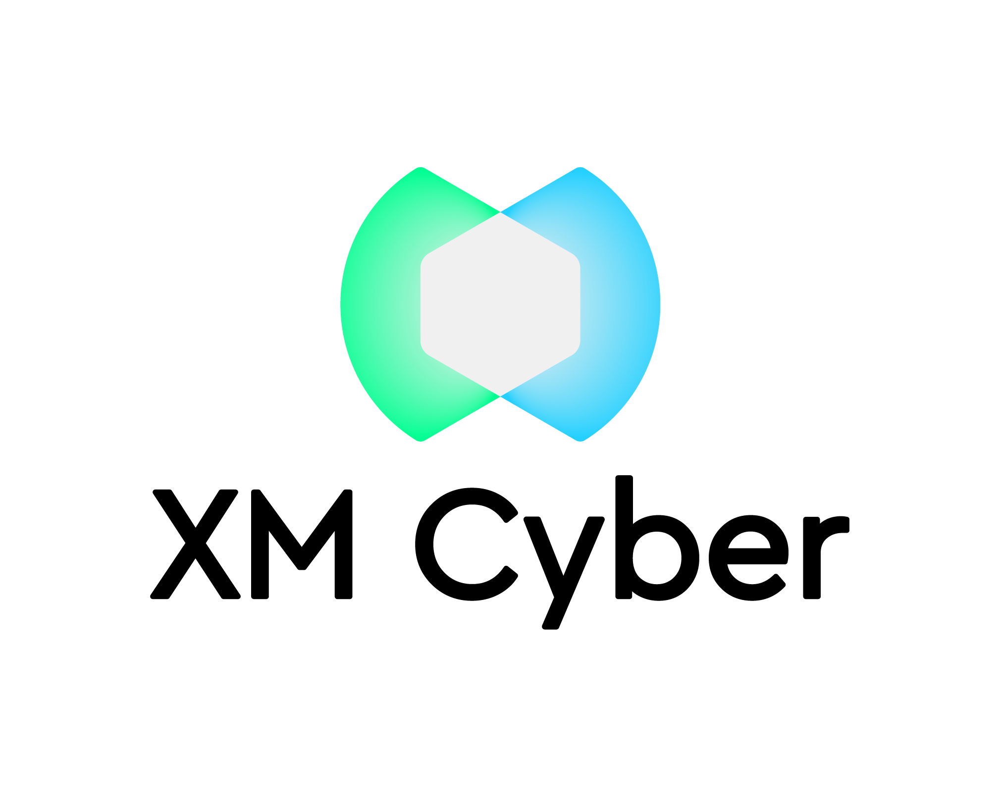





---

# Title

*Tagline*
Summary here

Epsiode Body here.

## Media

<video src='url'></video>

 Podcast Transcript 

1

Hello, this

is Darren Pulsipher chief solution

architect of public sector at Intel.

And welcome to Embracing

Digital Transformation,

where we investigate effective change,

leveraging people, process

and technology.

On today's episode, Precogs

Cyberattack Powers with Paul Giorgi

from XM Cyber.

Hey, Paul, welcome to the show.

Thanks, Darren.

Hey, Paul Giorgi

is our director of sales at XM Cyber.

When I first heard about XM Cyber,

I was like, I don't quite understand.

And then you guys coached me and taught me

and I was like, This is cool stuff.

Yeah.

So before we get into what you guys

do, tell me a little bit about yourself,

your background,

and how you ended up at XM Cyber.

Yeah, so I've been in security

since the late nineties,

started doing a lot of DHS

and DOD projects.

That was where I got my start.

There's a great place to learn

and have kind of an unlimited budget

to just do whatever.

I wanted to kind of secure the perimeter.

And I started there.

Ended up coming over and joining

a company called Fishnet Security,

doing sales engineering.

And that was back in 2005.

And then I fell in love

with sales engineering.

If you would have asked

the one who's managing the firewalls

that Paul

who was managing the firewalls back then,

if I'd ever get into anything

sales related,

I'd be like disgusted by the idea.

But I love sales engineering.

And so I really fell in love with it

at Fishnet.

And then my career has been kind of tied

within sales engineering.

I've worked at a few different places.

I participate as a co-founder

of a cybersecurity company

called Device Security.

I worked at exhibitions.

I love logs.

One thing I've always played around with

is breach and attack simulation.

I think that that's an emerging space.

The last few years that I fell in love

with an XM

Cyber Falls within that category.

And so when I was looking for

the next kind of adventure, I was like,

I want to do breach in attack simulation.

And then I surveyed

and I really fell in love

with what XM Cyber was doing

and their unique take.

And so that's that's how I ended up here.

Okay.

First of all, as you know what breach.

You know, simulation and attack

simulation,

you're dealing with blackout white

hat type of things going on here, right?

Yeah. Is that what it is?

Yeah.

There's categories of breach in an attack

simulation,

like you can automate pen test.

So if you want every single day

to run a test in your environment,

that is a category

of reaching exact simulation.

And then there's what we call

security control validations, where

if you're using CrowdStrike or Sentinel

One or Microsoft Defender or Silence

or whatever the EDR tool is,

and you want to make sure

that your solution's blocking specific

type of variance, you can launch things

that look and simulate

those type of behaviors

to see, is my policy protecting me?

Or if it is protecting

me, are my playbooks working the way

I anticipate them?

So there is definite value

in those type of use cases.

We don't

really address either one of those kind of

to the extent that our competitors do.

We do what's called attack

path management.

And attack path management is just

holistically assessing your environment

and giving you insight into

how an attacker might leverage entities

in your environment to laterally move

and compromised critical assets.

Okay.

So this is a this is different than what

we hear traditionally about cyber, right?

Yeah, traditionally,

it's detection, remediation prevention.

You know, those are

those are the typical things

you guys are doing, like predictive.

How can they get in?

If they do get in,

where can they go type of thing.

So you're like, oh, what's the right word?

It's like,

it's not

it's not like going to the doctor, it's

going to the gym.

Kind of, yeah,

I've sea of like a three cog sim or it's.

A great precogs now.

Now we got Minority Report going on.

I feel like that's been a good description

where it's like we're not correlating

a whole bunch of things

that are happening.

We're correlating a lot of stuff

that could have,

could have stringing them together,

a imaginative incident,

giving you insight into how your tools

might be able to address it,

how you could work to address remediations

on specific chokepoints,

and then if you think

about an organization

who learns a lot from a test, like back

when I was doing the DOD projects,

I was working at an Air Force base.

Every quarter we would have a pen test

and they would always get us

and it would just be so frustrating

that we'd spent so much time fixing stuff.

But my favorite time was

we would get around a conference table

and they would all share around, Hey,

we did this,

we did this, and then immediately

I would respond and address

all of the things

that they were doing to fix it.

And there was so much

we learned during those incidences.

So that's what we're trying to do.

But on a regular basis

and something where you can

fix things today,

see the impact of them tomorrow

and then continually increase

and improve your security.

So this can happen

well before pen testing then, right?

Yeah, that's the idea really.

There was one customer.

So so he says well so here's a question

then.

Yeah, right.

Could, could you have your red team

use your stuff to find their way around

the blue team and then go to town.

Right. Yeah.

So we actually have

that use case deployed.

And so your tool can be very dangerous.

Yeah.

I mean, if you think about

what we're doing, I use it in.

The wrong hands, right? Paul

Yeah, exactly.

Like Google Maps, for example,

is a good analogy where it's like,

Hey, I want to get from one place

to the next place.

Here's my starting point, here's

my ending point.

Google Maps will tell you

these are all the ways to get there.

We do that same thing.

But from an attack

simulation, we're saying,

hey, if you've compromised this

as your Active Directory user account,

these are the six steps that you can take

in this order to be able to get to like

an on premise domain controller

and compromise that critical assets.

So just like Google Maps will say this is

the route that we recommend you take.

This is the one that avoids tolls.

This one's the most scenic route.

We do that same thing. We'll tell you.

These are the six ways

to get from this point to this point.

And you think about how

that would help a red teamer.

It makes them super efficient.

They don't have to waste time

poking around and trying to do discovery.

They say, this is where I'm at.

I want to get over here

except tell me how to get there.

And so, yeah, you're right,

it is kind of scary being able to to show

all of that data in one specific view.

Well, yeah,

you're going to enable the red team by

you can also give it to the blue team too.

So that's

I guess that's the next question, right?

You guys run all these predictive

attack path analysis and so what do I do?

You give me all that information.

What do I do with it?

Yeah.

So there's this fascinating perspective.

From a blue team perspective.

You can now prioritize your remediations.

If we are showing you

the entities that are allowing an attacker

to most commonly compromise

your critical assets,

you want to focus

your remediations on those.

So we call them choke points

and think about a choke point as a

if I have 400 attack paths,

all going to different areas in my DMZ,

but all 400

seem to have to leverage this one entity

to make that attack path happen.

I just fixed that one problem

on that one entity.

I've really destroyed 400 attack paths.

So from a blue teamer, it allows you

to prioritize your efforts at making sure

that you've locked down these choke points

that could enable an attacker.

We know that if an attacker is able to get

something like a domain admin account

or get onto a machine

like a domain controller,

there's a lot of stuff

that they can wreak havoc on.

They basically own the environment

at that point, but in most environments

there are accounts or entities that are

riskier than your domain admin accounts

and without having any insight,

you don't know what those are.

But I'll tell you, there's a lot of

like a developer account

who has rights from a federated identity

and Google and Azure.

And from that one account, you're able

to get access to all these things.

And that's more powerful

than a domain admin account.

Or think about an into an admin

or just a regular domain user

who has rights to use the Intune

admin service.

They could push software to any

as your Active Directory admin machines

or as your Active Directory

domain machines and push software.

So that one account is even more dangerous

than to make them an admin

because it sits above another layer but

then has the ability to replicate down.

So it's an interesting perspective

to now start seeing what other accounts

even today introduce

more risk than a domain admin account.

All right.

So I got to back you up a little bit

because my my listeners

heads are spinning now.

Right.

So I want to kind of break this down

a little bit.

You talking about attack paths, so and

then you were talking about user accounts.

So yeah, obviously in in your past stuff,

there's more than just user accounts.

There's more than just what's connected to

what and what firewalls are.

So how would you break down?

I mean, let's break it down a little bit.

Yeah, I've got identity management

as one of the things.

So that's one of the things that you guys

leverage is, hey, who is who in the zoo?

Yeah, not just in my data center,

but it also sounds like in the cloud.

Yeah.

So you guys can handle multi-cloud access

management

and or you're analyzing the access.

You're not doing the access management.

You're analyzing

it, correct? Yeah. Is that

okay?

So that's the identity site.

So if I

this is going to be

if I have multiple identities, is there

any way for you to track to track that?

I am using multiple identities or not.

Is that just outside of the realm?

So we wouldn't I mean, we don't care

who owns what, but if if you've ever used

a tool called Bloodhound, they are doing

the same thing that we're doing.

We actually have the same exact features,

but kind of at a much larger level

where if you have access

to a specific Active Directory user,

we understand that this active direct user

can reset the password for another one.

And now this past, this user account

has the ability to now add a GPO

and then from that GPO,

we can then do this.

So sometimes attack paths will be ten

steps long, but nine steps.

So I'll just be navigating the identity

world and it's all just due to

you might have permissions to your admin

account and then that admin account

might have additional permissions.

So if you do six or seven steps

adjusting groups and adjusting

just different permissions

or resetting passwords and deploying GPOs,

you could kind of take nine steps

to go from standard Darren

or Darren's user account

to then get to the point

where you're at domain admin

just by leveraging Active Directory. Wow.

Most people don't even know that

that that's an attack stuff.

And it gets even. More right.

I mean, I've got identities. Yeah.

Yeah.

I can imagine

because, you know, cloud identities

even though they try and sync them up

between.

Yeah, they're unique identities, right.

They're not you know, they're unique.

Okay.

So identity is one path

that you guys follow on attacks.

What's another path that you guys follow?

Because it just can't just be identities,

right?

You're doing but not. Yeah.

And so I like to use the term entities

because it's a generic term

encompassing a lot.

So sometimes an entity in an attack

path is the user like we were talking

about another example of a common entity,

it would be a machine,

another entity would be like an S3 bucket.

It's not a machine, it's not a user.

It's just kind of a cloud storage area.

Another entity is a file

or an associates key.

I mean, the list is long

in our supported entities.

I think there's about a hundred, maybe

even more than that, where all of these

different entities can all be combined

together to create an attack path.

And sometimes, like I was saying,

it's an attack path of ten,

but nine of them are just user

like within the user space.

And then sometimes it gets really complex

where an attack

starts on premise,

goes out to as you're takes advantage

of maybe Azure Intune like that

example we're talking about before goes

back over to compromise another machine

that then allows you to pivot over to GCP.

They don't want you over in the GCP

environment taking advantage of

maybe some sort of like trust

or permission between AWB and GCP to

then compromise AWB.

So you get really complicated

and you look at all

these different types of entities

and the different disparate environments,

and then you connect them together

to assess these paths around

how every entity holistically plays

together in the risk of every other.

Oh, so, so wow.

I mean,

most I know because I do this myself

sometimes I set up those paths myself

because obscurity is a form of security.

At least we thought.

Yeah, but it sounds like to me

that with tools like yours, I'm sure

the bad guys have tools like this too.

Yeah.

Now, once you get in,

they start looking around for paths.

Yeah.

So you can't use obscurity anymore, right?

So even if you're hopping between

domains or hopping between cloud service

providers.

Yeah, it sounds like you really need

something to help you identify these.

So let's say. All right,

how does it work as a customer?

I bring you guys in

and it's professional services

or I just let your software just go hog

wild, crazy.

How how does it work?

Explain an engagement

with with a customer.

Yeah. So there's two main ways

that we get engaged.

Sometimes it's just at a high level

and on a discover

all my attack paths

and that's a great, great use case.

Sometimes it's

hey, we do pen tests every quarter,

we get so much insight and from them

I would like to kind of have these done

on a daily basis if I could afford it.

But I don't have a budget of $100 million

to do a pen test every single day.

So sometimes it's just at a high level.

I just want to be able

to assess my environment.

And in that case, when things

like filling out or log for a day

or spring for a show

like those vulnerabilities of the month

that kind of pop up under the radar,

it is a really strong value

to for an organization

to measure the impact of these

vulnerabilities, like, hey, yesterday

there was only ten attack pass

going to this critical asset.

Lena dropped on the scene

and now I have 100.

And so being able to measure

how an attacker can operationalize

new vulnerabilities in your environment

to put your critical assets at risk,

that's that's

kind of in line with that first customer.

The next customer,

when we kind of get engaged

is they'll have a specific scenario.

There was a really large bank

that we did a posse with last year,

their customer now.

But when we did the posse, they said,

we know that our offshore developers

have access to one small IWC environment.

That's all they should have access to.

But we're really concerned

that there is some way that they have

the ability to abuse

maybe different entities

in the environment

to be able to access production data.

So that was a different scenario

where they said,

I want to start here

and see if there's any risk to that.

And in that case,

it was two days later we were saying,

Yeah, look at how they can abuse

this lambda function.

From this lambda function.

They get this role from this role

they can do is crawl across to me

and assume role capability to then

get access to your production data.

So for however long

that they had this configuration,

they had this false sense of security

thinking that because all their offshore

developers were relegated to one.

Yeah, they had them in a.

More secure, like there's no way.

So they came to us saying like, Hey,

we want to verify this.

And so we ran through the simulations and

were able to say, Hey, you're not secure.

And by the way, it only takes three steps

to get from here.

Over there, it's very easy.

So they stopped the posse, fixed

all of those things and then

resumed the PSC and is now a customer.

And so those are kind of the two

main areas where we.

Are targeted, right?

Yeah, I have a specific problem.

And then also tell me where I'm at.

This one, to me,

this is kind of screaming for

this would have to be continuously run

because as soon as I add another entity

and as three bucket a new person,

I could have opened up Pandora's box.

Yeah.

Not only just the dynamic

nature of cloud,

but we also

track user behavior in our simulations.

So in most environments

I've found that the security score

goes up during the weekend,

and that's because we've removed the users

from the environment.

You're moving the users, rather,

the score goes up.

I mean, every network is more secure

with our users.

So that was one thing that you find.

So there's a lot of patterns, not only

just, hey, we deployed a new application

or Hey, we're, we have some elasticity

in our cloud environment.

We've got like this expansion

that normally doesn't happen.

So there's a bigger attack surface

or like the example I gave

the users are doing something different

today.

What's happening today that is putting us

more at a security risk than yesterday.

So it's just not you're not

just doing static analysis of of entities.

You're also doing dynamic because you're

looking at traffic patterns.

You're looking at

holy cow.

Yeah. Yeah.

I mean, that's that's why. Impressive.

Yeah, that is a lot.

And you said something interesting

and it's

kind of in in jest,

but a serious question.

You basically said

get rid of users off your network.

Well, I mean, for the most secure,

conscious for the most and limit

the number of users,

I think that that's a really good it's

kind of if we talk about least privileged

principles, I mean, the best way

to get rid of privileged

principle or implement that is getting.

Rid of years. Yeah.

All right.

The reason I brought those up

is because the OT environment.

Yeah.

Which is very different than I.T

and I'm doing a lot of research

right now in OT managed security and

the OT guys are scared out of their minds.

Right, because I think rightfully so.

Right.

Because if someone hacks into your

critical infrastructure or people die.

Yeah, right.

This is a big deal.

So can you guys

can you guys help with that

pathfinding across the entity barriers

or do I just say

there are no identities in the OT network?

But yeah,

I don't know if that's an answer.

So go to.

That specific use case

where it's a targeted use case

that's a really common targeted use case.

We have customers

like in the energy sector

or anybody really with an O.T environment

that probably is having that problem

or problem, but it's converging.

Everything's kind of the same networks

and so there's risk to that.

And the old school

skater guys managing their PLCs,

he thought they were isolated because,

hey, this doesn't connect to our network,

can no longer say that anymore.

So now you've got this problem

where, hey, is oti

the critical asset or the breach point?

If you think about kind of like attack

passes,

are we getting attacked from these devices

or to them or.

Right. And so we get to calculate that.

But to your description,

we definitely have that use case

commonly played out like, hey,

is there any way from my i.t.

Environment, let's play

the scenario of somebody in h.r.

If somebody in h.r.

As machine as the breach point,

is there any risk to this policy

sitting in my skate environment

controlling pressure switches

that could turn on and off the electricity

for some city municipality?

So that is a real use case

that we can simulate.

And if we do find

these are the attack pass,

it gives you insight to remediate them

before an attacker finds them

and then takes advantage of them.

So so this

would be really important

to to run these simulations.

So that's another question I have for you.

I mean, is this is this a SaaS offering

or is it on prem?

I think SAS would be a little scary for me

personally, right?

Yeah, because I'm like,

you're going to store in the cloud

somewhere how people can attack me.

I mean, that's scary, right? Yeah.

So we ask the solution.

Early on, we did have kind of

we did have an on premise solution,

but it was really hard to keep it updated.

Think about. How often we're.

Constantly adding new attack

techniques and new attack vectors.

And so it became such a problem for us

to constantly be trying

to update all of these on prem systems

that we eventually said

for us to deliver the best service

that we can and constantly stay dynamic

with every new vulnerability and a tactic

that comes out, we have to be SAS only.

And to your point,

it is a little scary to think about,

Hey, there's something in the cloud

that has all of our attack techniques.

We do a very, very

we put a lot of work to make sure

all of our data

is completely isolated, SOC two compliant

and all these different certifications

showing that we don't do any multi-tenant.

See everything is in it's

isolated tenants using a WAC

and so we make sure everything is isolated

and secure and we try not to collect

anything sensitive.

Now you think about stitching their

their attack pass and what appears like

that's sensitive but if you think about

what we're showing you, a lot of it

isn't as sensitive

as some things like data

setting credit card doubles, credit card

numbers, PII, so, so the password.

So when we are doing these attacks,

it's really common for us to say, hey,

we compromised this user account,

we have this password sitting here,

but we never send anything

sensitive to the cloud.

What we do is we hash it a bunch of times

and we actually sent half

or a portion of that hash up to the cloud.

So that way we can say, Hey, this password

is the same as this password over here.

So we can leverage it in a way

where we can kind of continue to use that,

that password in living off the land

from an attack perspective.

But we don't have to know what it is

and we try to do that

same sort of mentality on everything

or it's

if we don't need the actual data

that old kind of hash it, obfuscate it,

and then just compare it in the cloud.

But we have really large references

for customers

like Nasdaq, for example,

is a really big customer of ours.

We've got Fortune 50 banks.

So you have to like the scrutiny

that we've gone over to get those times.

You've already gone through that.

So yeah, yeah, I, I bet I was a big

it takes a while for them right.

Yeah. And there's some still. Yeah.

So thinking or cloud is scary

and it's somebody else's computer

and I don't like that. So yeah, I get it.

I feel that way, the same way

a lot of times too.

So I guess here's here's

another quick question.

Have you guys moved it

all into the government space

in state and local governments

or federal governments

or, you know, national governments?

Have you moved into that space yet

or are you still getting a little pushback

from them?

You mean just with the cloud adoption?

Yeah. With yeah, with the cloud adoption.

Yeah, I think so.

Most of our customers are in that space.

Put us

through

a little bit more of a effort test.

Of the ringer. Yeah, yeah.

And I mean, so, like,

we are owned by a German company,

the Schwartz Group that owns

XM Cyber Germany is known

for like a lot of really strict

privacy laws and things like GDPR

and all these different compliance.

So there is a kind of

an extra layer of scrutiny

just because we have to adhere

to these type of things like the GDPR

in a way that maybe we don't have to

as much in different areas in the States.

So right, it is definitely something

that we have to keep

staying in touch with and different,

different compliance

like Fedramp, for example,

if you're playing in federal space

and you want to SAS service

that adheres to Fedramp

and state fedramp compliant,

like there's a

lot of those type of things as well

that we continually have to work.

So you're so you're already in Fedramp.

You're in the gov cloud already. Not yet.

I think what we are, what do you call it

when it's pending authorization

so we don't have the certification. Right.

We're just going through that process.

You're going to.

Oh, that's good.

That's good. That's good to know. Yeah.

Okay, let's say that

I, I get all this information from you

guys.

You guys have shown me

where all my, my parts are.

Maybe I'm

not that sophisticated in my cyber.

Maybe I'm a mid-sized company. Yeah.

Do you guys have, like,

consulting services to help me figure out?

All right, you you found all these powers,

and I'm sitting there going,

I don't know what to do.

I mean, how do you educate me?

Or can you help me figure out what to do

or point me to a partner?

Maybe you guys have a partner

that does manage security.

I don't I don't know.

Yeah. What do I do?

So we have both every customer of ours

gets assigned what we call

customer success manager.

And they either have weekly

or biweekly meetings

where the whole goal of their sessions

together is just to take the data

that's coming out of our platform

and help them like actually use it.

If we're just running,

running these

theoretical is every single week,

but no one's fixing anything, then

we aren't really making anything better.

So what, you're not.

Making any progress? Exactly.

So what's really a fun takeaway or a fun

outcome of those sessions is commonly

those sessions will identify

a few things like, hey,

this chokepoint is impacted by this attack

technique.

It will.

These are the steps to remediate it.

Do you think we can have this done

by two weeks from now?

And then on the team, they'll assign

stuff, open tickets, put it in

for that change control window.

And then two weeks later, we get to now

see the impact and say, wow, look,

we had this fix.

Look at how it replicate

rippled across all the environment

and your security score goes up.

So that's kind of the main way

that we address

kind of using the solution

and not just turning in the shelf where.

But to your other point,

we do have a lot of partners.

There's a lot of like managed

service partners that we work with

who bolt on kind of these attack

simulation

offerings into their platform

and then allow them to have that value.

But the perspective it gives them

from a managed service, like an MDR,

really gives them a ton of insight

into the organization to help them

be better at offering those services.

Now that that that makes

that makes a lot of sense.

Yeah. Now I have another question.

You talked about the entities

and all that stuff.

What about if I have all of my stuff

encrypted?

Are he checking for encryption?

Because Intel, we've got

some cool technology around encryption

like memory

and use encryption right in SGX.

Are you guys looking down

at that level too?

So even if someone infiltrated

so what they can't seen.

Yeah.

So that's a really interesting point.

We just acquired a company called Cyber

Observer and cyber observer

kind of is more on the controls

and protection aspect of it.

So what we did before is

we kind of ignored encryption

or we ignored kind of security control

saying, Hey, this risk is still here.

So what they ended up being able

to download or access an encrypted blob.

They shouldn't have been able to do that

in the first place.

And there's risk to that because I

mean, we're talking about encryption.

I mean, we know that the post

quantum world and being able

to kind of be able to start

breaking encryption is not that far away.

So we don't want to have any data loss,

even if it is encrypted.

But now through this acquisition

of cyber observer,

cyber observer has API integrations

into different cloud

environments, the different security

controls, both cloud and on prem.

And now they can assess whether or not,

hey, that file that we simulated

a compromised on was

we had a simulation that there was

the acceleration that happened,

but cyber observer was able to say

it was encrypted

so you don't have to worry about it.

And then also things like

there was these three security controls

that probably would have made it harder

for that to happen.

So then we address it

and rate our our complexity factor.

So now with the insight of cyber observer,

we could say, hey,

without cyber observer, it looked like

this was a really easy attack.

But now there's this encryption to break.

There's this EDR solution

you have to bypass.

And so it now because cyber observer

told us that we're going to say

that this is still technically possible,

but it is something that's

going to be more complex than something

that doesn't have that.

Okay.

That that makes a lot of sense to me.

So with without this new acquisition,

you guys made it.

Can I get access?

Yeah.

Basically now it's like, Oh,

I got access, but it's guarded.

Yes, exactly.

I mean, I've always.

I can't understand it or, you know, what.

I've always referred to,

like security controls as safety nets

being like, hey, if something bad happens,

this will protect you.

And so we've never really evaluated

the safety net in the aspect of security.

So we've always said like,

hey, this is possible.

You probably shouldn't care

if there's a safety net or not.

Like this is something that's bad

that could happen

and I don't want to rely on that

safety net.

You should rely on the actual posture

of it in general without kind of falling.

So we would address those things first

to make sure you never have to leverage

the safety net.

But now we're at least kind of considering

whether or not the safety

nets exist and how strong they are

and can they help you?

Because now we actually have that insight

through our cyber observer

acquisition.

That's pretty cool.

That's

that's a nice addition for you guys.

Another thing that comes to mind,

I don't know if you guys handled this.

It's micro segmentation motion

or controlled.

I'm talking to a company

now called Felicity.

Really cool stuff

where they're controlling at layer two

and layer three where they're saying,

I'm getting rid of VLANs completely

and I'm controlling

traffic between devices directly.

Do you guys bring that into play too?

Like on the networking side

in micro segmentation or or you say, now

I got access and if these two machines

can talk, you're, you're yeah.

Yeah.

So we do play in that space

kind of when you're talking about like

the targeted use case, that would be one

where it's saying like, hey, I want to see

like how well my micro or macro

segmentation is actually in our help.

So yeah, we do take that into account.

The way that we do it is most of the time

if we are saying

that there is some sort of attack

that's happening between two machines

or there's a vulnerability being exploited

between two machines, we'll

look at the relevant

port number that that service runs on

and the exploit that it's running on.

And we will attempt to,

through a handshake to see like, hey,

can I talk on that appropriate

port number?

We don't pass

any data, there's no exploit happening,

but we are confirming connectivity.

So whether you're using a Lumia

or guard, a call or whatever,

the micro or macro segmentation

the solution is,

we will be aware of those controls

and that limitation.

So that way

if there is a vulnerable service running,

we will have insight into,

hey, these are the only three machines

in the environment

that actually exploit that vulnerability

because of those controls.

All that that is says, Yeah, cool,

you guys have some really amazing

technology.

Yeah, it's relevant and.

I. Would it's fun

because. Yeah, it's very real.

I'd be afraid to yeah, I'd be afraid

to release it on my own network.

I did that

when I first started at five or so.

I've got four kids.

I know you got a lot of kids.

And so it's one of those things

where I was able to see

which one of my kids machines puts

the most amount of risk to my network.

Is that storage device.

I've got a little synology device for

all of my critical stuff is sitting there.

So I built all the attack paths

and figured out that my daughter Rylan's

computer is a choke point

because of the way it was configured

so I fixed those

and then made it so that way.

At least all of the kids

computers risk are the same.

Oh, yeah.

Well, there you go.

You want to be an equal, equal opportunity

parent, right?

All the kids computers are.

Definitely especially the games.

They play the same

the same amount of risk.

Hey, Paul has been a pleasure.

This has been wonderful.

I learn. I learned a lot.

We may probably have to have.

You kind of love that. Yeah.

Cause I especially. I want to go.

I really want to go deeper into OT

because that's that's

a scary part for a lot of people today.

And I'm like I said before, I'm

doing a lot of research in this

in this area right now.

I have a lot of customers bugging

me. Darren, what do I do?

What do I do?

So we most

definitively need to talk again.

Okay. Yeah.

Next time, maybe I'll even pull up

in a use case and show you the interface.

And with those two scenarios,

that'd be fun.

Oh that, that would,

that would be awesome.

Hey, thanks again, Paul.

Thank you for listening

to Embracing Digital Transformation today.

If you enjoyed our podcast,

give it five stars on your favorite

podcasting site or YouTube channel.

You can find out more information

about embracing digital transformation

and embracingdigital.org

until next time, go out

and do something wonderful.

 Published Assets 

